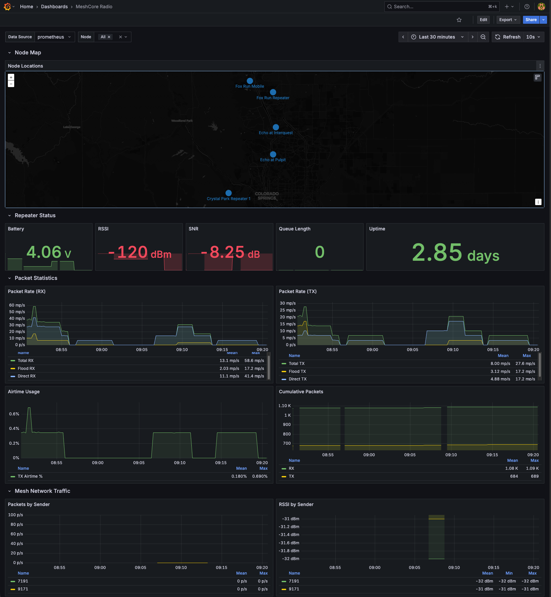

# meshcore-stats

Prometheus exporter for MeshCore repeater radio telemetry.

```
                                    LoRa
┌──────────────┐    Serial    ┌─────────────┐    Mesh    ┌──────────────┐
│ meshcore-    │◄────────────►│  Companion  │◄──────────►│   Repeater   │
│ stats        │   /dev/tty   │    Radio    │            │              │
└──────┬───────┘              └─────────────┘            └──────────────┘
       │ :9200/metrics
       ▼
┌──────────────┐              ┌─────────────┐
│  Prometheus  │─────────────►│   Grafana   │
│              │   queries    │             │
└──────────────┘              └─────────────┘
```

## Setup

### Linux Serial Permissions

Add your user to the `dialout` group to access the serial port:

```bash
sudo usermod -aG dialout $USER
```

Log out and back in for the change to take effect.

### Find Your Device

```bash
ls -la /dev/serial/by-id/
```

## Usage

### Local Stats (USB Companion Radio)

```bash
meshcore-stats -port /dev/ttyACM0 -addr :9100
```

### Remote Repeater Stats

Query a remote repeater over the mesh network:

```bash
meshcore-stats -port /dev/ttyACM0 -repeater "MyRepeater" -password "secret"
```

The radio will login to the named repeater and periodically query its stats.

### Flags

| Flag | Default | Description |
|------|---------|-------------|
| `-port` | `/dev/ttyACM0` | Serial port for MeshCore radio |
| `-baud` | `115200` | Baud rate |
| `-addr` | `:9200` | Address to expose metrics on |
| `-interval` | `10s` | Scrape interval |
| `-repeater` | | Repeater name to login and query (enables remote mode) |
| `-password` | | Password for repeater login |

## Metrics

| Metric | Description |
|--------|-------------|
| `meshcore_battery_millivolts` | Battery voltage in millivolts |
| `meshcore_temperature_celsius` | Device temperature in degrees Celsius |
| `meshcore_uptime_seconds` | Device uptime in seconds |
| `meshcore_error_flags` | Error flags bitmask |
| `meshcore_queue_length` | Outbound packet queue length |
| `meshcore_noise_floor_dbm` | Radio noise floor in dBm |
| `meshcore_last_rssi_dbm` | Last received signal strength in dBm |
| `meshcore_last_snr_db` | Last signal-to-noise ratio in dB |
| `meshcore_tx_airtime_seconds_total` | Cumulative transmit airtime |
| `meshcore_rx_airtime_seconds_total` | Cumulative receive airtime |
| `meshcore_packets_received_total` | Total packets received |
| `meshcore_packets_sent_total` | Total packets sent |
| `meshcore_packets_flood_tx_total` | Packets sent via flood routing |
| `meshcore_packets_direct_tx_total` | Packets sent via direct routing |
| `meshcore_packets_flood_rx_total` | Packets received via flood routing |
| `meshcore_packets_direct_rx_total` | Packets received via direct routing |
| `meshcore_scrape_errors_total` | Total number of scrape errors |
| `meshcore_login_status` | Login status (1=logged in, 0=not logged in) |
| `meshcore_mesh_packets_observed_total` | Mesh packets observed by sender |
| `meshcore_mesh_packet_rssi_dbm` | Last RSSI of packets from a mesh sender |
| `meshcore_mesh_packet_snr_db` | Last SNR of packets from a mesh sender |
| `meshcore_mesh_packet_bytes_total` | Total bytes observed from mesh senders |
| `meshcore_node_latitude` | Node latitude in degrees |
| `meshcore_node_longitude` | Node longitude in degrees |

## Grafana



Import the included `grafana-dashboard.json` for a pre-built dashboard with:
- Repeater status (battery, RSSI, SNR, queue, uptime)
- Packet statistics (RX/TX rates, airtime usage)
- Mesh network traffic by sender
- Health monitoring

## Install as systemd Service

```bash
# Create config file (edit with your repeater name and password)
sudo cp meshcore-stats.env.example /etc/meshcore-stats.env
sudo chmod 600 /etc/meshcore-stats.env
sudo nano /etc/meshcore-stats.env

# Install systemd unit
sudo cp meshcore-stats.service /etc/systemd/system/
sudo systemctl daemon-reload
sudo systemctl enable meshcore-stats

# Build and install binary
make install

# Check status
sudo systemctl status meshcore-stats
journalctl -u meshcore-stats -f
```

### Configuration

Edit `/etc/meshcore-stats.env`:

```bash
SERIAL_PORT=/dev/ttyACM0
REPEATER_NAME=Fox Run Repeater
REPEATER_PASSWORD=your-password-here
```

### Management

```bash
sudo systemctl stop meshcore-stats     # Stop service
sudo systemctl restart meshcore-stats  # Restart service
sudo systemctl status meshcore-stats   # Check status
journalctl -u meshcore-stats -f        # View logs
```
